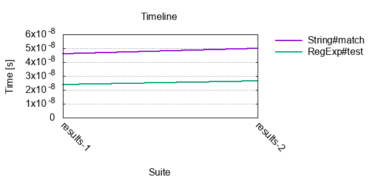
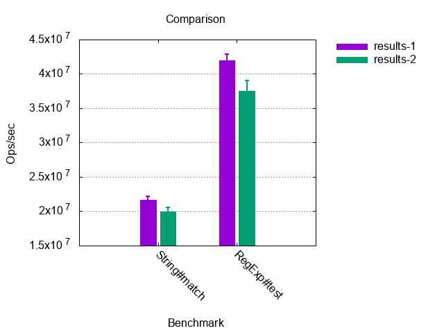

# benchart
[](http://badge.fury.io/js/benchart)
[](https://travis-ci.org/prantlf/benchart)
[](https://codecov.io/gh/prantlf/benchart)
[](https://david-dm.org/prantlf/benchart)
[](https://david-dm.org/prantlf/benchart#info=devDependencies)

[](https://www.npmjs.com/package/benchart)

Plots a performance chart for [Benchmark.js] results saved by [astrobench-cli].

 

## Pre-requisites

Chart generation requires [`gnuplot`] installed. It is freely available on any platform.

On Linux, install from the distribution package. For example, on [Ubuntu]:

```
sudo apt install gnuplot
```

Using [Homebrew] on OSX:

```
brew install gnuplot
```

Using [Chocolatey] on Windows:

```
choco install gnuplot
```

## Getting Started

Make sure that you have [Node.js] >= 10 installed. Install `benchart` globally:

```
npm i -g benchart
```

Plot a performance chart for all results in a directory:

```
$ benchart results
```

### Testing Scenario

Testing page:

```html
<link rel="stylesheet"
      href="https://unpkg.com/@prantlf/astrobench@1.1.0/dist/astrobench.min.css">
<script src="https://unpkg.com/@prantlf/astrobench@1.1.0/dist/astrobench.min.js"></script>

<div id="astrobench"></div>

<script>
  suite('A suite', suite => {
    const text = 'Hello world'
    bench('Validate greeting by regular expression', () => text.match(/^H/))
    bench('Validate greeting by comparison', () => text[0] === 'H')
  })
</script>
```

Tool installation:

```
npm i -g astrobench-cli benchart
```

Chart generation:

```
$ astrobench -j output/results.json example/index.html
$ benchart output
```

## Command-Line Usage

The `benchart` script plots a chart for statistics produced by [Benchmark.js] and written out to JSON files by [astrobench-cli].

```
$ benchart --help

Usage: benchart [options] <directory>|<file> ...

Options:
  -V, --version               output the version number
  -d, --out-directory <path>  path to the output directory
  -n, --out-name <name>       file name of the written chart (default: "chart")
  -p, --type <type>           type of the chart (default: "timeline")
  -t, --title <title>         chart title (default: "Benchmark Results")
  -w, --width <number>        width of the charter in pixels
  -g, --height <number>       height of the charter in pixels
  -i, --y-min <number>        minimum value on the y axis
  -a, --y-max <number>        maximum value on the y axis
  -y, --y-property <name>     property shown on the y axis (default: "hz")
  -r, --error-bars            show standard error of the mean
  -b, --x-label <label>       label of the x axis
  -e, --y-label <label>       label of the y axis
  -c, --cluster-by <input>    cluster histogram bars
  -l, --legend-place <place>  legend placement (default: "outside")
  -v, --verbose               print progress of the plotting
  -h, --help                  output usage information

 Reads all "*.json" files from the specified directory, unless a list of
 files is specified. The chart will be written to the input directory,
 unless an output directory is specified. Chart types are "timeline" or
 "comparison". Histograms can be clustered by "benchmark" or "suite".
 Legend places are "left", "right", "outside" and "under". Property shown
 on the y axis can be "hz" or "mean".

Examples:

 $ benchart results
 $ benchart -rv -t "Sizes" -d results -n comparison \
     -p comparison results/50.json results/100.json
```

## Programmatic Usage

Make sure that you have [Node.js] >= 10 installed. Install `benchart` locally in your project  with [npm] or [yarn]:

```
npm i benchart
yarn add benchart
```

Plot a chart for all JSON files in the `results` directory and store it with the name `chart` in the same directory:

```js
const plot = require('benchart')
await plot({ directory: 'results' })
```

### plot(options: object): Promise<>

The main module exports a function which generates the chart to the output directory and returns a [Promise] resolved when the chart has been written.

Recognised options:

* `directory: string` - directory to look for the input JSON files
* `out-directory: string` - path to the output directory
* `out-name: string` - file name of the written chart (default: "chart")
* `type: string` - type of the chart (default: "timeline", otherwise: "comparison")
* `title: string` - chart title (default: "Benchmark Results")
* `width: number` - width of the charter in pixels
* `height: number` - height of the charter in pixels
* `y-min: number` - minimum value on the y axis
* `y-max: number` - maximum value on the y axis
* `y-property: string` - property shown on the y axis (default: "hz", otherwise: "mean")
* `error-bars: boolean` - show standard error of the mean (default: `false`)
* `x-label: string` - label of the x axis
* `y-label: string` - label of the y axis
* `cluster-by: string` - cluster histogram bars by "benchmark" or "suite"
* `legend-place: string` - legend placement (default: "outside", otherwise: "left", "right", and "under")
* `verbose: boolean` - print progress of the plotting
* `verbose: boolean` - print progress of the chart generation (default: `false`)

## Data

An example of a JSON file with test results. Benchmark properties `aborted`, `error`, `hz`, `stats` and `times` are described in the [Benchmark.js documentation]:

```json
[
  {
    "name": "A suite",
    "benchmarks": [
      {
        "name": "String#match",
        "aborted": false,
        "hz": 21672040.42791444,
        "stats": {
          "rme": 1.394724557215958,
          "mean": 4.2691777736331135e-8
        }
      },
      {
        "name": "RegExp#test",
        ...
      },
      {
        "name": "Benchmark with error",
        "error": {
          "message": "text is not defined",
          "name": "ReferenceError",
          "stack": "@test/example/bench.js:19:6
            Benchmark.uid1580598679888createFunction@test/example/index.html:3:124"
        },
        "aborted": true
      }
    ]
  }
]
```

## Contributing

In lieu of a formal styleguide, take care to maintain the existing coding
style.  Add unit tests for any new or changed functionality. Lint and test
your code using `npm`.

## License

Copyright (c) 2020 Ferdinand Prantl

Licensed under the MIT license.

[`gnuplot`]: http://www.gnuplot.info/
[Ubuntu]: https://ubuntu.com/
[Homebrew]: https://brew.sh/
[Chocolatey]: https://chocolatey.org/
[astrobench-cli]: http://github.com/prantlf/astrobench-cli
[Benchmark.js]: https://benchmarkjs.com/
[Node.js]: http://nodejs.org/
[npm]: https://www.npmjs.org/
[yarn]: https://yarnpkg.com/
[Promise]: https://developer.mozilla.org/en-US/docs/Web/JavaScript/Reference/Global_Objects/Promise
[Benchmark.js documentation]: https://benchmarkjs.com/docs
